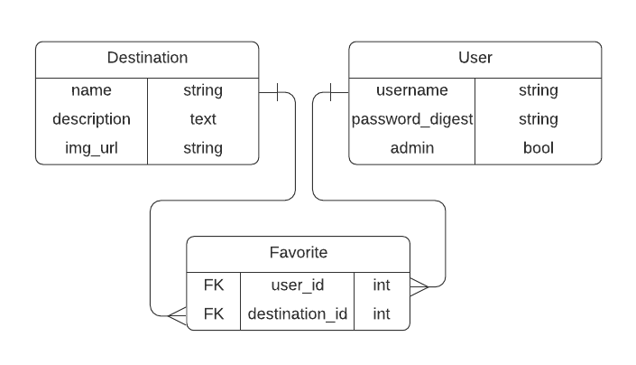

# Next Destination (Back-End)

Next Destination is an app that allows you to browse through the world's top touristic destinations and lets you save them for future reference. An admin user can create, update, and delete destinations.

This is the API for the Next Destination app. The React [front-end repository can be found here](https://github.com/sebGilR/next_destination_fe).

## Built With

- Ruby
- Rails
- Posgresql
- RSpec

## Live Demo

- [View Live Demo](https://feature-app.d1cjah403cwq78.amplifyapp.com/)
- Log in with the user "testuser" and password "nextdestdemo" to test the app or sign up for a new user.

## ERD



## Request routes available

- GET    /api/v1/destinations(.:format)          ->              api/v1/destinations#index
- POST   /api/v1/destinations(.:format)          ->              api/v1/destinations#create   -    auth + admin
- GET    /api/v1/destinations/:id(.:format)      ->              api/v1/destinations#show
- PUT    /api/v1/destinations/:id(.:format)      ->              api/v1/destinations#update   -    auth + admin
- DELETE /api/v1/destinations/:id(.:format)      ->              api/v1/destinations#destroy  -    auth + admin
- GET    /api/v1/favorites(.:format)             ->              api/v1/favorites#index       -    auth
- POST   /api/v1/favorites(.:format)             ->              api/v1/favorites#create      -    auth
- DELETE /api/v1/favorites/:id(.:format)         ->              api/v1/favorites#destroy     -    auth
- POST   /api/v1/users(.:format)                 ->              api/v1/users#create
- POST   /api/v1/auth/login(.:format)            ->              api/v1/sessions#create
- DELETE /api/v1/auth/logout(.:format)           ->              api/v1/sessions#destroy      -    auth

## Features

- User sign up
- Password authentication
- Destinations creation, update, deletion, and retrieval.
- Destinations can be marked as favorites by users.
- Users can have many destinations marked as favorites.

## Potential Features

- Specific controller to allow for more admin actions.
- Allow saving images to some sort of cloud storage.

## Getting Started

To get a local copy of the API up and running, follow the next steps:

### Prerequisites

- Ruby: 2.7.0
- Rails: 6.0.3.2
- Postgres: >=9.5

### Setup

Download or clone this repo, and cd into it.

Install gems with:

```
bundle install
```

Install postgresql on your machine and [set up a user](https://www.ionos.com/community/hosting/postgresql/how-to-use-postgresql-with-your-ruby-on-rails-application-on-ubuntu-1604/) before the next steps.

Setup database with:

```
rails db:create
rails db:migrate
```


### Usage

Start server with (port 4000 is used so that the front end can run on port 3000):

```
rails s -p 4000
```


### Run tests

```
bundle exec rpsec
```


## Authors

👤 **Sebastian Gil Rodriguez**

- Website: [sebgil.me](https://sebgil.me)
- Github: [@sebGilR](https://github.com/sebGilR)
- Twitter: [@sebGilR](https://twitter.com/sebGilR)
- Linkedin: [sebastiangilrodriguez](https://www.linkedin.com/in/sebastiangilrodriguez)

## 🤝 Contributing

Contributions, issues, and feature requests are welcome!

Feel free to check the [issues page](https://github.com/sebGilR/next_destination/issues).

## Show your support

Give a ⭐️ if you like this project!
